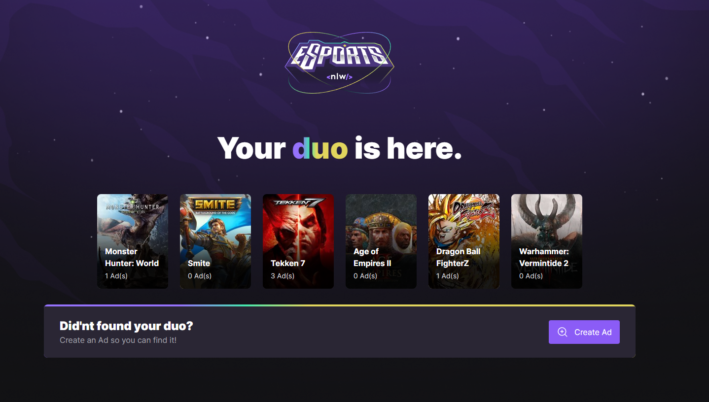
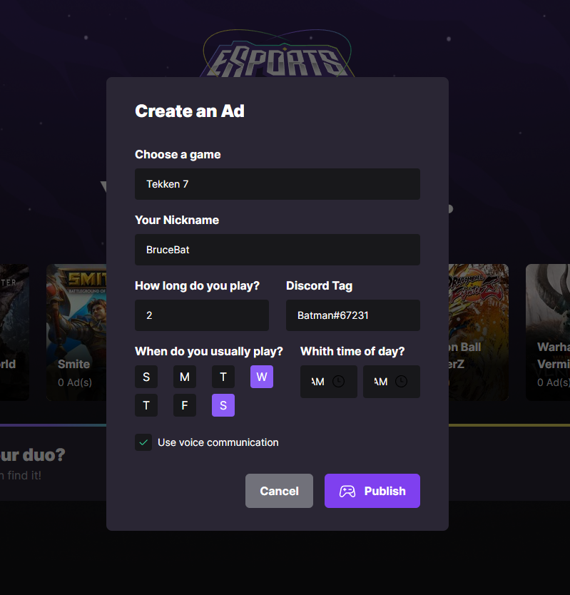
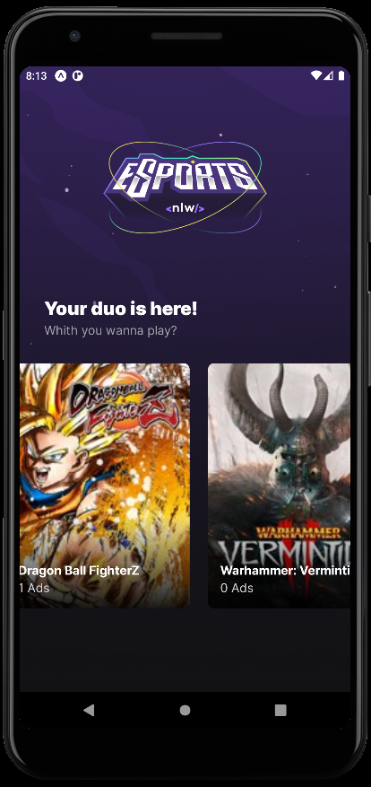
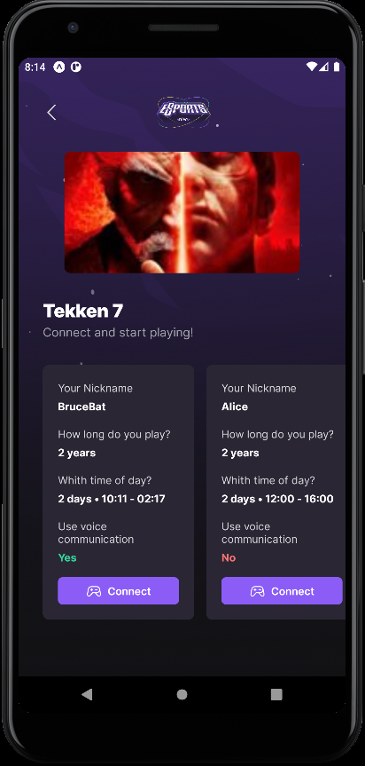
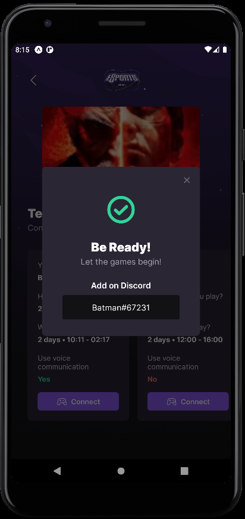

<h1 align="center">
	<a href="./Web/src/assets/logo-nlw-esports.svg">
		" width="369" height="223"/>
	</a>
</h1>


  
 </h1>

 <p align="center">
	<a href="#-about">About</a> •
	<a href="#-layout">Layout</a> • 
	<a href="#-start-project">How to start the project</a> • 
	<a href="#-on-the-way">On The Way</a> •
	<a href="#-tech">Tech Stack</a> • 
	<a href="#-tech">Version</a> •
	<a href="#-special-thanks">Special Thanks</a>
</p>
	
	
</h1>

<a id="-about"></a>

## The Project
<p align="center"> 
	Project developed during the NLW Rocketseat programming event.
	The application consists of a platform where users can register their discord IDs on their games of interest, creating an advertisement for other users to find them and join a group to play the game.
	
</p>

<p align="center"> 
	<h4 align="left">How it works</h4>
	The project has 3 layers. A Server consisting of a SQLite database with APIRestful for broad access to database information. A consuming Web and Mobile application that stores and consumes the Server database.
</p>


<a id="-layout"></a>

## Layout

<p align="center">
	"/>
	"/>
	"/>
	"/>
	"/>

</p>

<a id="-start-project"></a>

## How to start the project

To run this project, you must first start the Server application with the command:
```bash
npm run dev
```
Then you can start the web app with the same command:
```bash
npm run dev
```
To run the mobile app, you first need to start the mobile emulator, after running the emulation, you can start the app with the command:
```bash
expo start
```
OBS.: Don't forget to install the application's dependencies by running the command below in each part of the project.
```bash
npm install
```


<a id="-on-the-way"></a>

## On The Way

- [ ] Add an ;
- [ ] Aprimoramento de componentes;

<a id="-tech"></a>

## Tech Stack
 <p align="center">
	 
	
	
	
	
	
	
	
	
	
</p>

- <h4>Web</h4>
- [x] TypeScript
- [x] ReactJS
- [x] Vite
- [x] Tailwind
- [x] Phosphor Icons
- [x] Radix
- [x] Axios

- <h4>Mobile</h4>
- [x] TypeScript
- [x] React Native
- [x] Expo
- [x] Phosphor Icons

- <h4>Server</h4>
- [x] TypeScript
- [x] NodeJs
- [x] Prisma
- [x] Hoppscotch

<a id="-version"></a>

## Version

- Version 0.8 (pre-alpha)

<a id="-special-thanks"></a>

## Special Thanks
<p align="center"> 
	

	Special thanks to Diego Fernandes, Rodrigo Gonçalves and the entire Rocketseat team for providing this experience.
</p>
